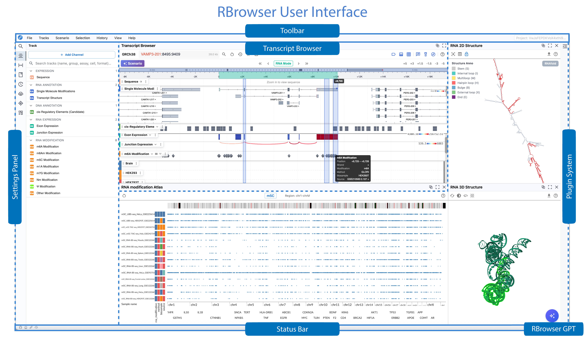

<!--
 * @Author: Zheng Lei
 * @Email: baimoc@163.com
 * @Date: 2026-01-08 15:54:38
 * @LastEditTime: 2026-01-09 18:00:26
 * @FilePath: \rbrowser-doc\docs\2_quick_start\1_user_interface.md
-->
# RBrowser User Interface

**The RBrowser UI is designed as an intuitive, high-resolution platform for exploring RNA–DNA crosstalk and transcriptome regulation.
It is divided into six key regions:**

## Transcript Browser

- The Transcript Browser displays tracks from various data types (i.e., channels).  
- Tracks are listed in the Settings Panel (sorted and color-coded by Channel) when Track Display is selected. 
- Tracks are stacked vertically with a color-coded Track Label for easy comparison of binding, structure, modifications, and splicing. Tracks can be rearranged, renamed, downloaded, etc. See [Track Management](3_channel_and_track.md).
- The secondary toolbar within the Transcript Browser allows you to search the display tracks, navigate coordinates, zoom, and enable/disable navigation tools (e.g., track labels, grid lines, tooltip cursor, cursor coordinates, etc.).  See [Transcript Browser](../docs/2_quick_start/2_main_viewer.md)
- Exons and junctions are rendered as arrowed segments indicating structure and direction. 
- To view more detailed information embedded in data (e.g., cell line, TSS distance, binding protein name), hover over track with the Tooltip Cursor enabled.

## Settings Panel

The Settings Panel on the left side displays information relevant to the current tools being used (see list below).  The display can be changed by 1) clicking on an icon on the left or 2) using the Toolbar commands.  (Note: Favorites, DataHub, ASO Design, and Plugin Store are accessible only through the icon panel.)

- **Search:** Provides a global search box to locate genes, transcripts, coordinates, or keywords across loaded datasets. See [Track Management](3_channel_and_track.md).
- **Track:** Manages tracks sorted by track type (e.g., RNA annotation, DNA annotation, etc.) See [Track Management](3_channel_and_track.md).
- **Selection:** Lists selection coordinates. Toggle between RNA and DNA mode using the blue box. See [Region Selection](5_region.md).
- **Favorites:** Manages favorited regions for later review. Regions can be favorited by selecting the star icon in the Transcript Browser.
- **History:** Manages chronological log of your actions within the session. Note: The search bar in this view is specific to the session history. Individual history entries can be deleted by hovering over the region and selecting the trash icon.
- **DataHub:** Opens DataHub in a new window to explore external RNA sources and repositories. See [DataHub](docs/4_datahub/1_datahub_overview.md).
- **Plugin Store:** Manages available plugins developed by the RBrowser team and community.The sidebar has two areas: 1) icons that allow you to quickly toggle between navigation tools (below) and 2) an informational panel that displays information pertinent to the sidebar selection. See [Plugin System](../3_plugins/1_plugin_overview.md).

## Plugin System

Enabled plugins are displayed in an interactive visualization window on the right side or bottom of the interface. Plugins can be enabled or disabled in the Settings Panel when See [Plugin System](https://doc.rbrowser.org/3_plugins/).

## Toolbar
The global toolbar provides navigation tools useful across use cases.
- **File:** Open/Create/Save projects. Download images of the current Transcript Browser display. Supported files: .png, .jpeg, .svg, .pdf
- **Tracks:** Open the Tracks Panel in Sidebar or load new tracks from DataHub, a URL, or your local computer. 
- **Scenario:** Select from curated RBrowser states (e.g., RNA Modifications, RNA interactions, RNA chromatin) to quickly open tracks relevant to your inquiry.  Scenario can also be changed by clicking the blue Scenario icon in the Transcript Browser navigation panel. See [Scenario]((../2_quick_start/1_scenario.md).
- **Selection:** Open Selection Panel in Sidebar.  Hide/Show/Clear regions selected in the Transcript Browser.
- **History:** Open History Panel in Sidebar.
- **View:** Show/hide track labels, gridlines, tooltip hints, selected regions, and cursor position.
- **RBrowser GPT:** Icon for opening natural language personal assistant. See[RBrowser GPT]((../2_quick_start/6_rbrowser_gpt/) 

## Status Bar
*Non-interactive* display for data-loading progress, cache hits, and thread utilization.
