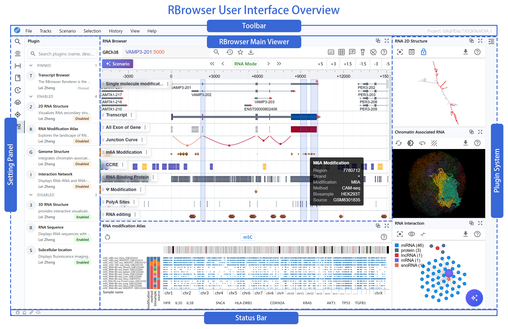

<!--
 * @Author: Zheng Lei
 * @Email: baimoc@163.com
 * @Date: 2026-01-08 15:54:38
 * @LastEditTime: 2026-01-09 18:00:26
 * @FilePath: \rbrowser-doc\docs\2_quick_start\1_user_interface.md
-->
# RBrowser User Interface

## 1. Overview

The RBrowser UI is designed as an intuitive, high-resolution platform for exploring RNA–DNA crosstalk and transcriptome regulation.

The UI divided into five key regions:

1. **Toolbar** (top): Global menus and controls
2. **Main Browser View** (center): Continuous, RNA-centric signal display
3. **Setting Panel** (left): Manage transcripts, tracks, history, plugins, and related content
5. **Plugin System** (right): Extensible panels for structures and interactions
6. **Status Bar and Agent** (bottom): Coordinates, load status, notifications, and RBrowser Agent.

---

## 2. Toolbar

The global toolbar provides navigation tools useful across use cases.

- **File**: Open new projects or download images of the current Main Viewer display. Supported files: .png, .jpeg, .svg, .pdf
- **Tracks**: Open the Tracks Panel in Sidebar or load new tracks from DataHub, a URL, or your local computer. 
- **Scenario**: Select from available plug-ins (i.e. list) to investigate different aspects of transcriptome
- **Selection**: Open Selection Panel in Sidebar or hide/show/clear selected regions
- **History**: Open History Panel in Sidebar
- **View**: Show/hide track labels, gridlines, tooltip hints, selected regions, and cursor position

---

## 3. Setting Panel

The sidebar has two areas: 1) icons that allow you to quickly toggle between navigation tools (below) and 2) an informational panel that displays information pertinent to the sidebar selection.

- **Search**: Provides a global search box to locate genes, transcripts, coordinates, or keywords across loaded datasets.   
  [How to search?](2_main_viewer.md)
- **Track**: Displays a list of tracks sorted by track type (e.g., RNA annotation, DNA annotation, etc.) Add tracks from your local computer, a URL, or from DataHub by selecting.   
  [How to manage tracks?](3_channel_and_track.md)
- **Selection**: Lists selection coordinates. Toggle between RNA and DNA mode using the blue box.   
  [How to manage selection?](5_region.md)
- **Bookmark**: Save and organize regions of interest for later review.
- **History**: Browse/search a chronological log of your actions within the session. Note: The search bar in this view is specific to the session history.
- **DataHub**: Open DataHub in a new window to explore external RNA sources and repositories.   
  [How to use Datahub?](../4_datahub/1_datahub_overview.md)
- **Plugin Store**: Enable/disable optional extensions that enhance the core browser developed by the RBrowser team and community. Using this panel instead of the Scenario menu in the Toolbar allows you to enable multiple plugins simultaneously. The search box in this panel searches available plugins only.   
  [How to use Plugin?](../3_plugins/1_plugin_overview.md)

---

## 4. Main View

The Main Viewer displays tracks from various data types (i.e., channels). The tracks are listed in the Sidebar (sorted and color-coded by Channel) when Track Display is selected. Tracks are stacked vertically for easy comparison of binding, structure, modifications, and splicing.

The secondary toolbar allows you to search the display tracks, navigate coordinates, zoom, and enable/disable navigation tools (e.g., track labels, grid lines, tooltip cursor, cursor coordinates, etc).

Exons and junctions rendered as arrowed segments indicating structure & direction. To view more detailed information embedded in data (e.g., cell line, TSS distance, binding protein name), hover over track with the Tooltip cursor enabled.

Rearrange, delete, and download tracks by clicking the : on the right side of the Track Label. Select Map to Region to autoselect the region associated with the track signal.

Select Map to Region to automatically choose the genomic region linked to the current track signal. Also, enable Auto Sync to propagate this selection across other plugins—so different views update together automatically.

- **Annotation Channel**  
  RNA annotations channel: single-molecule mods, m6A, Ψ, exon, junction, CCRE, RBP, eQTL, sQTL
  and Other singals
- **Expand Channel**  
  Expand each channel to view per-sample datasets (e.g. HeLa, HEK293T, HSC d0/d3/d6/d9)
- **Controls**  
  Collapse/expand, remove, adjust opacity or color mapping
- **RNA-Centric Signals**  
  Converts discrete DNA-coordinate features into smooth, continuous tracks focused on transcript coordinates
- **Isoform Visualization**  
  Exons and junctions rendered as arrowed segments indicating structure & direction
- **Multi-track Overlay**  
  Vertically stacked tracks for side-by-side comparison of binding, structure, modifications, splicing
- **Interactive Navigation**
  Click-and-drag panning, scroll-wheel zooming, real-time redraws

---

## 5. Plugin System

The Interactive Visualization Window opens on the right/bottom side of the Main Viewer for the scenarios/plug-ins listed below.

[Go to Plugin System](https://doc.rbrowser.org/3_plugins/)

---

## 6. Status Bar

- **Coordinates & Scale Text**  
  Displays chromosome, start–end positions, and zoom scale (bp/pixel)
- **Load & Cache Status**  
  Icons/text for data-loading progress, cache hits, thread utilization

---

RNA Browser transforms discrete genomic coordinates into a unified, RNA-focused visualization framework. By integrating multi-modal annotations and extensible plugins—spanning secondary and tertiary RNA structures through interaction networks—it provides researchers with an intuitive, high-resolution platform for exploring RNA–DNA crosstalk and transcriptome regulation.
