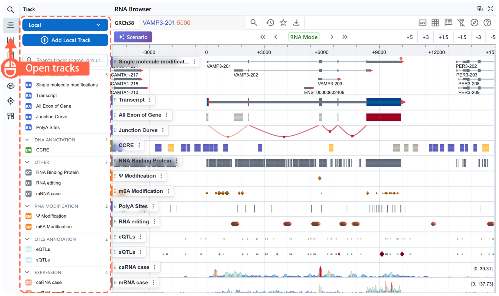
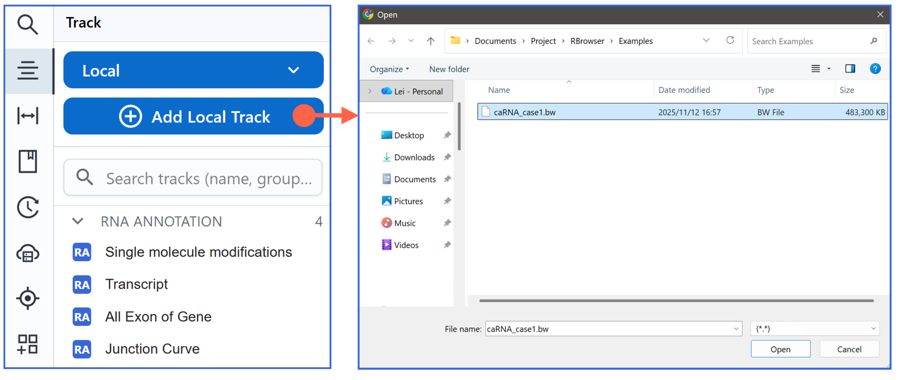
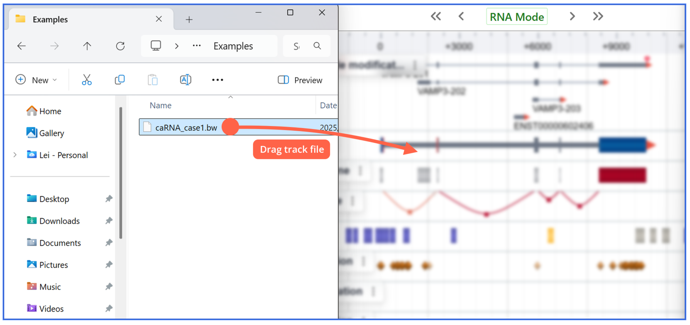
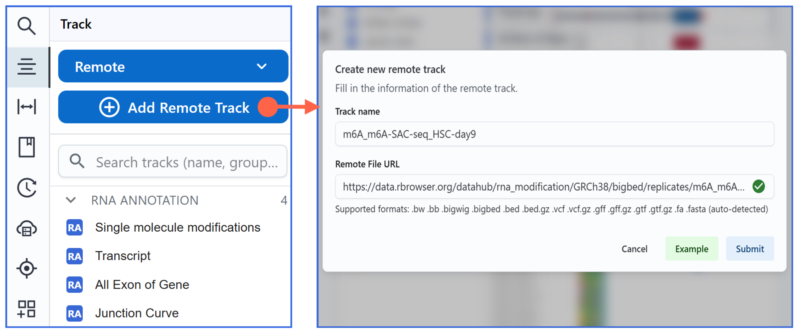
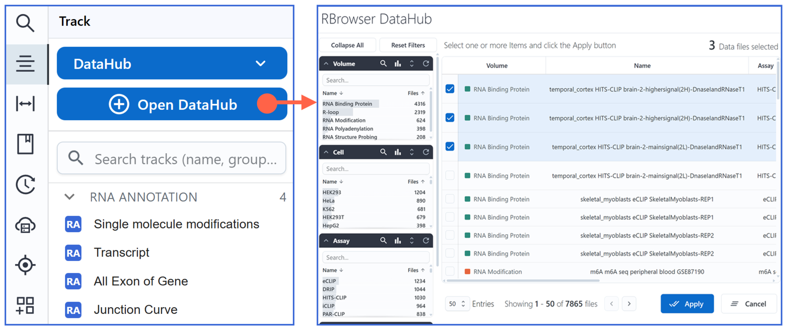
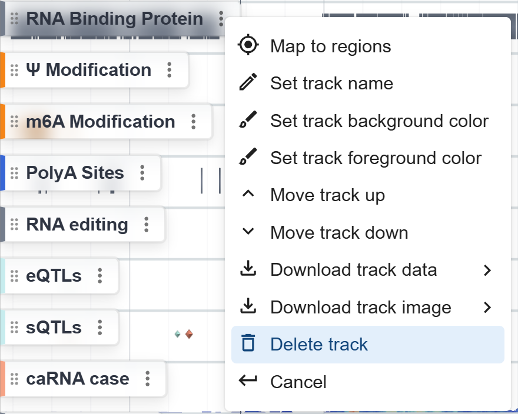
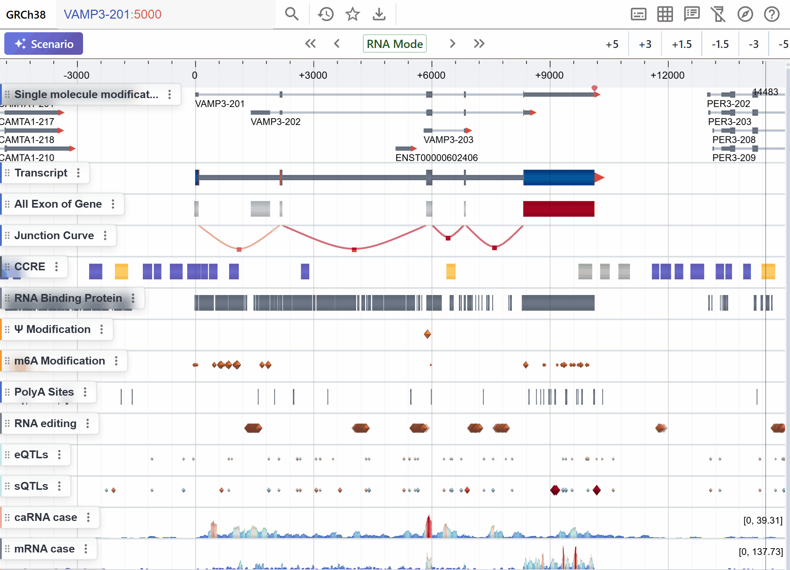
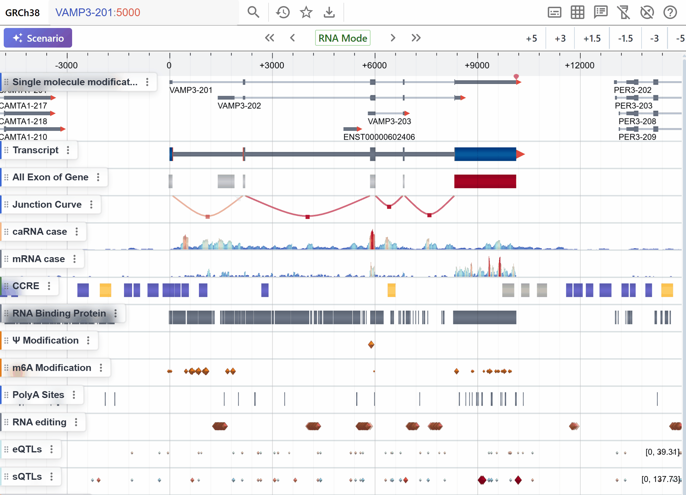

# Channel and Track

## Channel and Track Panel

{ class="cover-image" }

- You can click the Track Panel on the left to view and manage all channels and tracks.
- A Channel contains a predefined set of tracks grouped by data type.  


### Expanding Channels  
A channel may contain multiple individual tracks. To expand a channel and view all its sub-tracks:  
1. Hover over or click the channel’s **Track Label** in the sidebar.  
2. Open the context menu and select **Explode**.  

---

### Searching Tracks
You can search for specific tracks within a channel by keyword. This feature will allow you to quickly locate tracks of interest.

---


## Loading Tracks

1. **Open the Track Panel**  
   Click the **Track** button in the left sidebar to open the track operations panel. You can choose different track loading methods depending on your needs.

2. **Choose Local Files**   
  Use the file loader to import data from your local computer.

    { class="cover-image" }

    !!!Warning
        Modern browsers (e.g. Chrome) do not allow saving session state for locally-loaded files.  We recommend loading from **Remote** or **DataHub** when you need to preserve your session.

3. **Drag Local Files**   
    Drag and drop files directly into the RBrowser Main Viewer — they’ll be automatically parsed and rendered.

    { class="cover-image" }

    !!!tips
        The quickest way to load local files is to drag and drop them directly onto the RBrowser window.  

4. **Load Remote Files**  
    First, select Remote from the dropdown. Then click Add Remote Track to open the remote track loader.First, select Remote from the dropdown. Then click Add Remote Track to open the remote track loader.

    { class="cover-image" }

    !!!tips
        RBrowser can automatically detect bioinformatics files, including the file format and accessibility. If the data requires an index (e.g., bed.gz), you need to provide both the data file and its index file.

5. **Load DataHub Data Source**  
   You can open the **DataHub** to browse and load RNA-centric curated datasets.

   { class="cover-image" }


---

## Removing Tracks

{ class="cover-image-sm" }

1. **Open the Track Menu**  
   Hover over or click the track’s label in the sidebar to reveal its context menu.
   
2. **Remove the Track**  
   Click **Remove Track** in the menu. The selected track will be immediately removed from the main browser view.


## Sorting Tracks
1. **Drag to reorder**  
  Left-click and hold the area to the left of a track label, then drag the track up or down. Release the mouse at the desired position.
  { class="cover-image" }

2. **Click to reorder**  
  Open the **Track Menu**, then click **Move Track Up** or **Move Track Down** to shift the track vertically.
  { class="cover-image" }

---

## Filtering Tracks Data *(TEST)*  
Use the **Filter** command in the **Track Label** context menu to restrict which tracks are displayed:

- **Annotation-based (string) filters**  
  ```js
  rbrowser:get('name') == 'YTHDF2'  // Show only tracks with gene name “YTHDF2”
  rbrowser:get('type') == 'CDS'     // Show only CDS-region tracks
  ```

- **Value-based (numeric) filters**
```js
  rbrowser:get('score') > 10        // Show only signals with score > 10
```