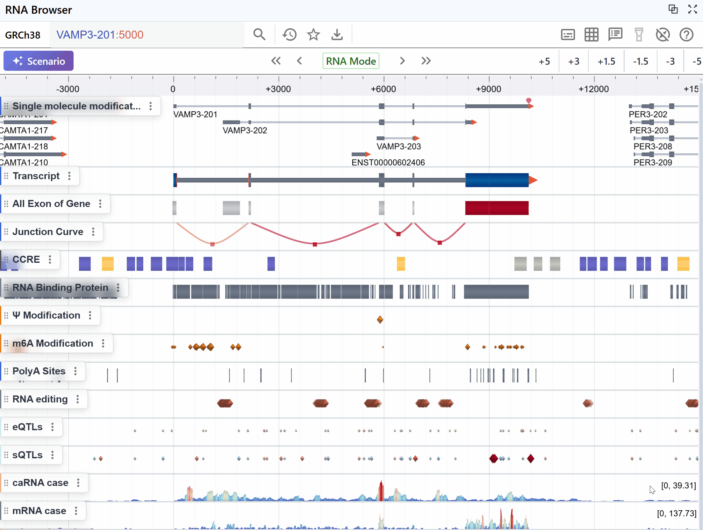
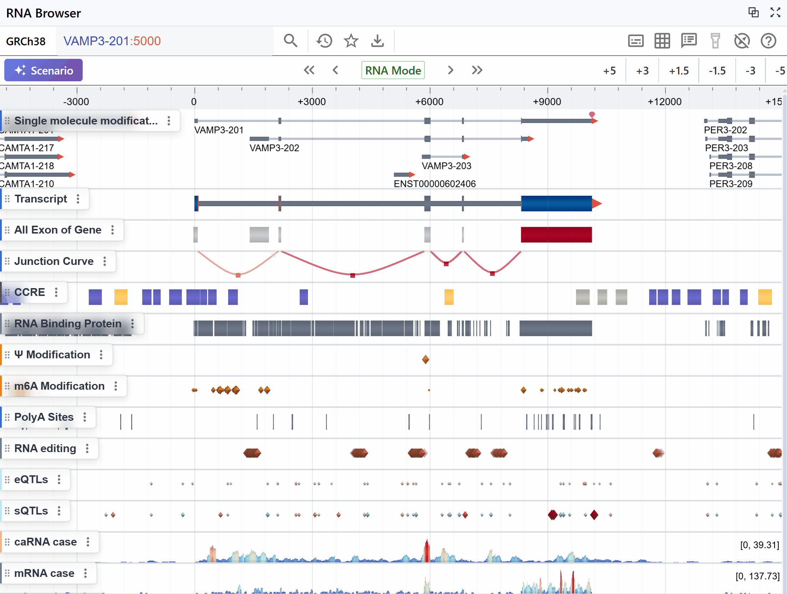
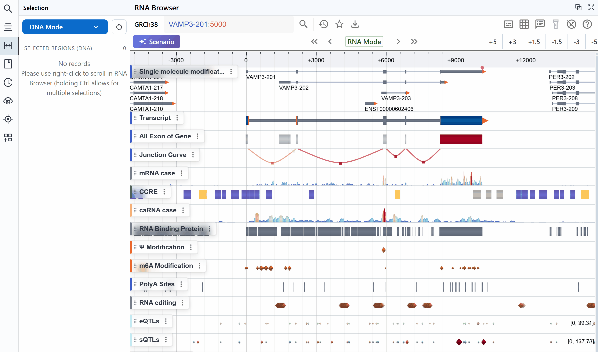

<!--
 * @Author: Zheng Lei
 * @Email: baimoc@163.com
 * @Date: 2026-01-08 15:54:38
 * @LastEditTime: 2026-01-09 16:39:15
 * @FilePath: \rbrowser-doc\docs\2_quick_start\5_region.md
-->
# Selection Region

## Search Region

Users can enter a region of interest in the **Search Input** at the top navigation bar and click the search button to navigate to that interval. Supports rendering by **RNA coordinates + flanking regions**.

{ class="cover-image" }

## Highlight Region

- **Single selection**  

    Hold the <kbd>Mouse Right</kbd> and drag over a region of interest to highlight it.  
    The highlight icon in the top-right corner toggles the visibility of the current highlighted region.

- **Multiple selection**  

    Hold <kbd>Ctrl</kbd> + <kbd>Mouse Right</kbd> drag to select and highlight multiple regions at once. 

    { class="cover-image" }

## Region Management

After selecting one or more regions, you can edit them in the **Region Panel** on the left sidebar.

### Switching Region Modes

{ class="cover-image" }

- **DNA Mode**  

    Regions are displayed using traditional genomic (chromosome) coordinates.  

- **RNA Mode**  

    Regions record and display only intervals **within** the spliced transcript.  
    
- **CDS Mode**  
    Regions span only the **coding sequence**, skipping introns and UTRs.

### Adding a Region

Click the **＋** button in the panel’s top-right corner to add a new highlighted region.

### Editing a Region

Click the **start** or **end** coordinate under **Location** to modify the selected region.

### Removing a Region

Click the **trash** (delete) icon to remove the corresponding region.
